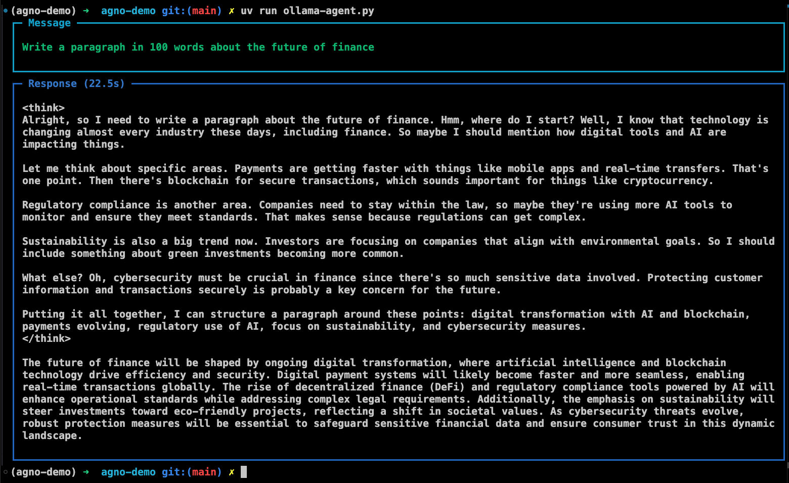
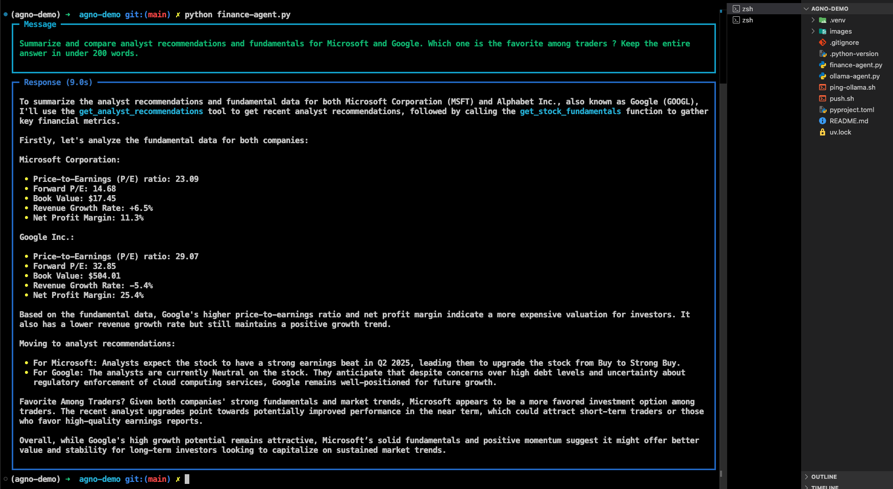
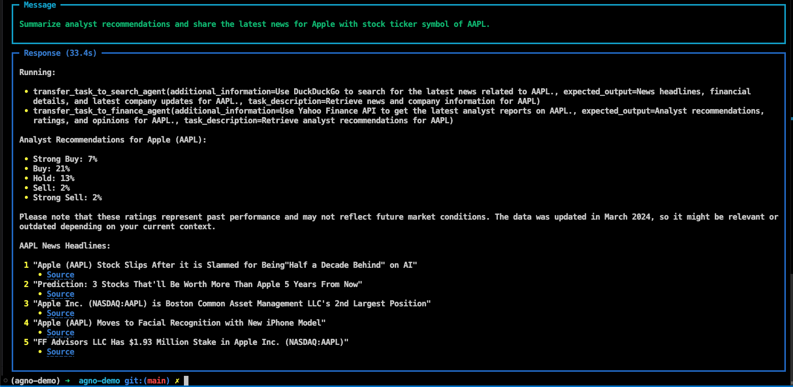
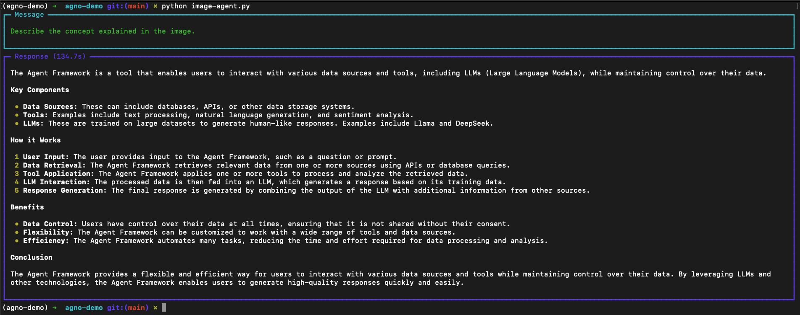

# AI Agents using `agno` and Ollama

Agents example list:

1. [Simple Ollama Agent](./ollama-agent.py)
   The first basic agent that uses Deepseek R1 (8B parameter) model.

2. [Finance Agent](./finance-agent.py)
   A simple finance agent using Yahoo Finance tool and Qwen 2.5 (1.5B parameter) model via Ollama.

3. [Team of Agents](./agent-teams.py)
   The team of agents uses DuckDuckGo search and Yahoo finance to summarize analyst recommendation and share latest news for a company given its stock ticker symbol.

4. [Image Agent](./image-agent.py)
   The image agent reads an image and uses Llama 3.2 vision model to describe the image.

5. [Knowledge Agent (WIP)](./knowledge-agent.py)
   The knowledge agent reads a PDF using PyPDF and uses ChromaDB (a vector database) to store embeddings (using Ollama embedder) and retrieve knowledge based on user queries.

---

## Basic Architecture


---

## Requirements

- [uv](https://github.com/astral-sh/uv)
- [ollama](https://github.com/ollama)

---

## Commands

1. Initialize the project

```bash
uv init
```

2. Create a Python virtual environment using `uv`

```bash
uv venv --python=3.13.2
```

3. Install `agno` (previously phi data) and `ollama`

```bash
uv add agno
uv add ollama
```

4. Pull Deepseek R1 (8B) and Qwen 2.5 (1.5B) models from Ollama registry

```bash
ollama pull deepseek-r1:8b

ollama pull qwen2.5:1.5b
```

5. Run the simple ollama-agent app

```bash
uv run ollama-agent.py
```



---

## Finance agent using Yahoo Finance tool

- Run the finance-agent app

```bash
uv run finance-agent.py
```



---

## Team of Agents

Finance agent works with Search agent to find the analyst recommendation for a company.

```bash
uv run agent-teams.py
```



---

## Image Agent

Reads an image and uses Llama 3.2 vision model to describe the image.

Model used: Llama 3.2 (11B parameter)



---

## Knowledge Agent (WIP)

Reads a PDF using PyPDF and uses ChromaDB (a vector database) to store embeddings (using Ollama embedder) and retrieve knowledge based on user queries.

Model used: Llama 3.2 (3B parameter)

---

## License

This repository is licensed under the [MIT License](LICENSE).
